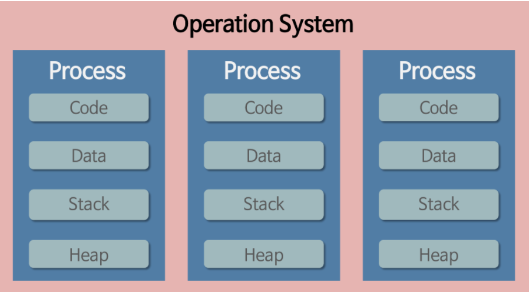
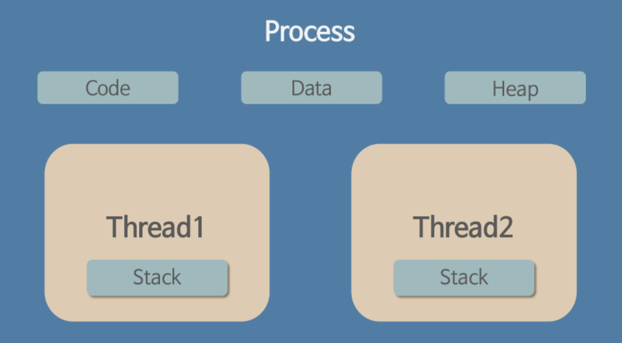
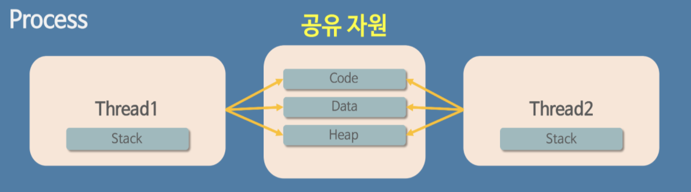

# 프로세스와 스레드의 비교

## 프로그램이란

- 사전적 의미: 어떤 작업을 위해 실행할 수 있는 파일

## 프로세스란

### 프로세스의 사전적 의미

- 메모리에 적재되어 CPU 자원을 할당 받아 실행되는 `프로그램`.

### 할당받는 시스템 자원

- CPU 시간
- 주소 공간
- Code, Data, Stack, Heap 구조로 된 독립된 메모리 영역
  

### 프로세스의 특징

- 프로세스는 각각 독립된 메모리영역(code, data, heap, stack)을 할당받으며, 다른 프로세스의 변수나 자료구조에 접근 불가하다
- 다른 프로세스의 자원에 접근하려면 파이프, 파일, 소켓 등을 이용해 통신해야한다.
- 프로세스는 최소 1개의 메인 스레드를 갖고 있다.

## 스레드란

### 스레드의 사전적 의미

- 프로세스의 작업단위.
  

### 스레드의 특징

- 프로세스 내에서 stack만 따로 할당받고, code, data, heap 영역은 공유한다.
- 한 스레드가 프로세스 자원을 변경하면, 이웃 스레드도 그 변경결과를 즉시 볼 수 있다.
- 프로세스 내에서 스레드 간 자원을 공유하거나 하지 않는 경우 둘 다 있다.

# 멀티 프로세스와 멀티 스레드 비교

## 멀티 프로세스

### 멀티 프로세스의 사전적 의미

- 하나의 응용프로그램을 여러 개의 프로세스로 구성하여 각 프로세스가 하나의 태스크를 처리하도록 하는 것이다.

### 멀티 프로세스의 장점

- 여러 자식 프로세스 중 하나가 죽어도 다른 프로세스에는 영향이 미치지 않아, 정상적으로 수행된다.

### 멀티 프로세스의 단점

- 멀티 스레드보다 많은 메모리 공간과 CPU 시간을 차지한다.
- Context Switching의 오버헤드 발생
  - 사전적 의미: CPU에서 여러 프로세스를 돌아가며 작업을 처리하는 것. 동작 중인 프로세스를 대기하며 해당 프로세스의 상태(context)를 보관하며, 대기중인 다음 순서의 프로세스가 동작한다.
  - 캐쉬 메모리 초기화 등의 무거운 작입이 진행된다.
  - 프로세스는 각각 독립된 메모리영역을 할당받기 때문에 프로세스 사이에서 공유하는 메모리가 없어서 캐쉬메모리를 하고 다시 캐쉬 정보를 받아와야 한다.
- 프로세스간 복잡하고 어려운 통신기법
  - 프로세스는 독립된 메모리영역 때문에 프로세스간 자원을 공유할 수 없고, 복잡하고 어려운 통신을 거쳐야 한다.

## 멀티 스레드

### 멀티 스레드의 사전적 의미

- 하나의 응용프로그램을 여러 개의 스레드로 구성하고, 각 스레드로 하여금 하나의 작업을 처리하도록 함.

### 멀티 스레드의 장점

- 멀티 프로세스보다 적은 메모리 공간을 차지하고 context switch가 빠르다.
- 스레드 간 통신에 별도의 자원을 이용하지 않고도, 전역변수 공간이나 heap 영역을 통해 데이터를 주고 받을 수 있다.
- 스택을 제외한 모든 영역이 메모리를 공유하므로 통신 부담이 적다.

### 멀티 스레드의 단점

- 스레드간 자원을 공유하기 때문에, 하나의 스레드만 오류로 종료되어도 전체 스레드가 종료될 수 있다.
- 동기화문제: critical section
  - critical section이란? 동일한 자원을 동시에 접근하는 작업을 실행하는 코드 영역이다.
  - 스레드 간에는 전역 변수를 공유하므로 함께 사용할 때 충돌이 발생할 수 있다.
  - 해결책
    - Lock(하드웨어 기반): 동시에 공유자원에 접근하는 것을 막기 위해 Critical section에 진입하는 프로세스는 Lock을 획득하고, Critical section을 빠져나올 때, Lock을 반납한다.
    - Semaphores(소프트웨어 기반)
      - 카운팅 세마포: 가용 자원의 개수로 초기화되어, 자원을 사용할 때마다 세마포가 감소하고, 방출하면 세마포를 증가시킨다.
      - 이진 세마포(Mutual Exclusion): 이진수로 초기화되어, 한 개의 스레드만 접근할 수 있다.
      - Deadlock 문제 발생
        - 스레드/프로세스가 자원을 얻지 못해 다음 처리를 하지 못하는 상태로, ‘교착 상태’라고도 하며 시스템적으로 한정된 자원을 여러 곳에서 사용하려고 할 때 발생한다.
        - 해결책
          - 여러 개의 스레드/프로세스가 공유자원을 이용할 수 있도록 한다.
          - 스레드/프로세스가 실행되기 전 필요한 모든 자원을 할당한다.

### 멀티 프로세스 대신 멀티 스레드를 이용하는 이유는?

- 자원의 효율성 증대
  - 멀티스레드로 작업할 경우, 프로세스를 생성하여 자원을 할당하는 시스템콜이 줄어든다.
  - 프로세스간 context switch 시, CPU 레지스터뿐만 아니라 RAM과 CPU 사이의 캐쉬까지 초기화되어 오버헤드가 크기때문.
  - 스레드는 프로세스 내 메모리(stack 제외)를 공유하기 때문에 통신 비용이 적다.
  - 스레드 간 context switch 시, stack만 전환하면 되므로, 전환 속도가 빠르다.

# 싱글 스레딩과 멀티 스레딩

## 싱글 스레드

### 싱글 스레드의 특징

- 하나의 프로세스에서 하나의 스레드 실행.

### 싱글 스레드의 장점

- 공유자원을 접근하는 동기화 문제를 신경쓰지 않아도 된다.
- context switch 작업을 요구하지 않아서, 전환 비용이 들지 않는다.
- 두 개의 작업에 대해 두 개의 스레드를 할당하여 작업할 경우에도 CPU를 선점하는 과정에서 context switch가 발생하는데, 단일 스레드에 비해 비용이 증가할 수 있다.

### 싱글 스레드의 단점

- 여러 개의 CPU를 활용하지 못한다.

## 멀티 스레드

### 멀티 스레드의 특징

- 하나의 프로세스에서 다수의 스레드 실행.
- 프로세스 내에서 자원을 공유하여 자원 생성과 관리 중복을 최소화.
- 서버가 많은 요청을 효율적으로 수행할 수 있는 환경 제공.
- 각각의 스레드가 고유의 레지스터와 스택으로 표현된다.

### 멀티 스레드의 장점

- 새로운 프로세스를 생성하는 것보다 기존 프로세스에서 스레드를 생성하는 것이 빠르다.
- 프로세스의 자원과 상태를 공유하여 효율적으로 운영이 가능하다.
- 프로세스의 작업전환보다 스레드의 작업전환이 더 빠르다.

### 멀티 스레드의 단점

- 하나의 스레드만 실행중일 때는 실행시간이 오히려 지연될 수 있다.
- 멀티 스레딩을 위해 운영체제의 지원이 필요하다.
- 스레드 스케쥴링을 신경써야 한다.

### 어느 상황에서 멀티스레드/싱글스레드를 쓸 것인가?

---

출처

- https://gmlwjd9405.github.io/2018/09/14/process-vs-thread.html
- https://jwprogramming.tistory.com/12
- https://beenlife.tistory.com/114
